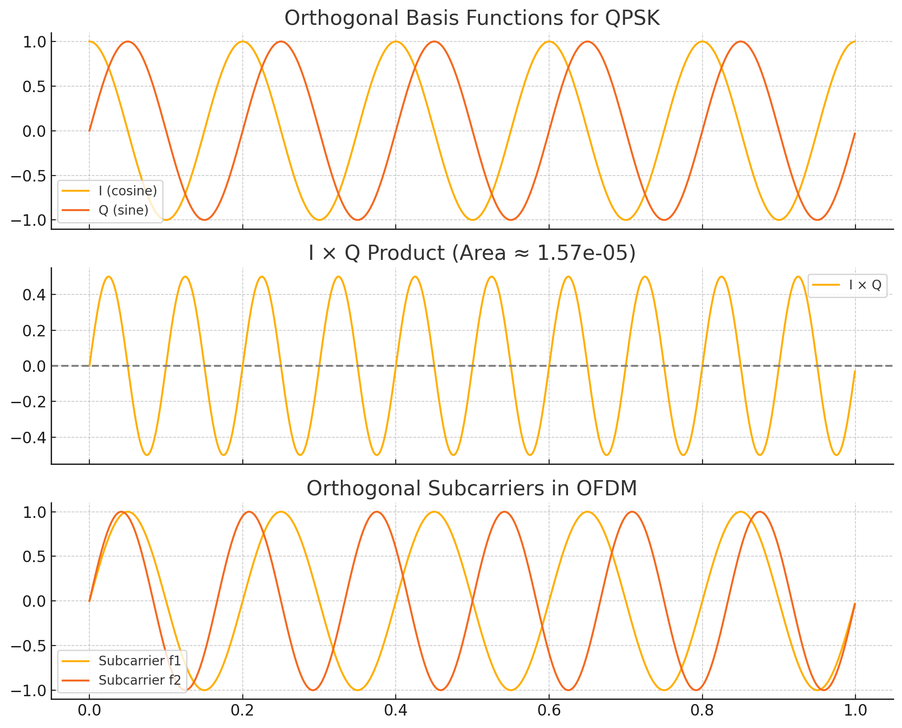

## Orthogonality 

Orthogonality is a key concept in communication systems, and it plays a critical role in both modulation and multiple 
access schemes like OFDM. Let’s break it down in the context of constellation diagrams:

⸻

🔷 What Does Orthogonality Mean?

In communication, two signals are orthogonal if their inner product (integral of their product over a symbol period) is zero. This means that they do not interfere with each other when transmitted simultaneously — a powerful property that enables multiple signals to coexist.

⸻

📈 In Terms of Constellations

🔹 QPSK and Orthogonality

QPSK uses two orthogonal basis functions:
	•	In-phase (I): a cosine wave cos(2πft)
	•	Quadrature (Q): a sine wave sin(2πft)

These two signals are 90° out of phase, and their dot product (over one symbol period) is zero.

➕ How It Relates to the Constellation

In a constellation diagram:
	•	Each point corresponds to a linear combination of these two orthogonal basis signals.
	•	The I-axis and Q-axis are perpendicular (orthogonal) axes.
	•	Each constellation point is located at coordinates (I, Q), and decoding is simply projecting the received signal onto each axis.

This separation is error-resilient: the noise on the I component doesn’t affect the Q decision, and vice versa.

⸻

🔹 Visualizing Orthogonality

If you draw the basis vectors (1, 0) and (0, 1) in a 2D constellation space:
	•	The vector (1, 0) lies along the I-axis.
	•	The vector (0, 1) lies along the Q-axis.
	•	These vectors are orthogonal (dot product is zero), forming the foundation for signal separation.

Even in 16-QAM, which includes amplitude changes, signals are still expressed in terms of I and Q axes — so orthogonality still underpins the modulation.

⸻

📡 In OFDM (Orthogonal Frequency Division Multiplexing)

In OFDM, orthogonality is in frequency:
	•	Subcarriers are spaced such that the sinc-shaped spectra of each subcarrier intersect at zero crossings of all others.
	•	Mathematically:
∫ sin(2πf₁t) · sin(2πf₂t) dt = 0 if f₁ ≠ f₂ (properly spaced).

This allows overlapping carriers with no interference — maximizing spectral efficiency.

⸻

✅ Summary

Concept	Orthogonality Means…	How It Helps
QPSK constellation	I and Q signals don’t interfere	Simple, independent demodulation
QAM constellation	Still based on I/Q orthogonality	Enables higher-order modulation
OFDM	Subcarriers don’t interfere even when overlapped	Parallel transmission of data

⸻

Generate a plot that visualizes this orthogonality in the constellation or in signal space

Here’s a visualization of orthogonality in digital modulation:
	1.	QPSK I and Q Components: The in-phase (I) and quadrature (Q) components are cosine and sine waves of the same frequency. 
Their inner product (area under the curve of their product) is approximately zero — confirming orthogonality.
	2.	I × Q Product: The product of the I and Q signals oscillates around zero, and its integral over a symbol period is nearly zero. 
This means the receiver can separate the two without interference.
	3.	OFDM Subcarriers: The two sine waves at frequencies f1 and f2 are orthogonal over a symbol period — a key idea behind OFDM, 
allowing many signals to coexist without interference.

Let me know if you’d like to simulate rotation, noise, or other effects on this. 